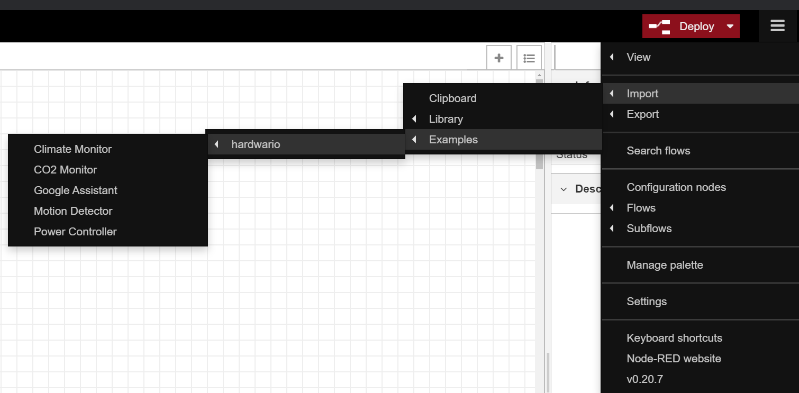

# HARDWARIO Node-RED Examples

> Set of helpful examples to get you started with the multifunctional industrial HARDWARIO IoT Kits.

[![NPM Version][npm-image]][npm-url]
[![Downloads Stats][npm-downloads]][npm-url]


## Installation

OS X & Linux & Windows

```sh
npm i @hardwario/node-red-contrib-hardwario --save
```

## Usage example

Use the top right menu to select an example from the **hardwario** menu to import it.



## Meta

Distributed under the MIT license. See `LICENSE` for more information.

---

Made with &#x2764;&nbsp; by [**HARDWARIO a.s.**](https://www.hardwario.com/) in the heart of Europe.

<!-- Markdown link & img dfn's -->

[npm-image]: https://img.shields.io/npm/v/@hardwario/node-red-contrib-hardwario.svg?style=flat-square
[npm-url]: https://www.npmjs.com/package/@hardwario/node-red-contrib-hardwario
[npm-downloads]: https://img.shields.io/npm/dm/@hardwario/node-red-contrib-hardwario.svg?style=flat-square
[wiki]: https://developers.hardwario.com/
